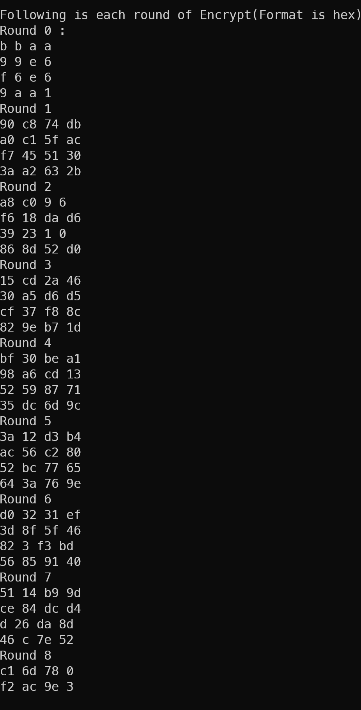
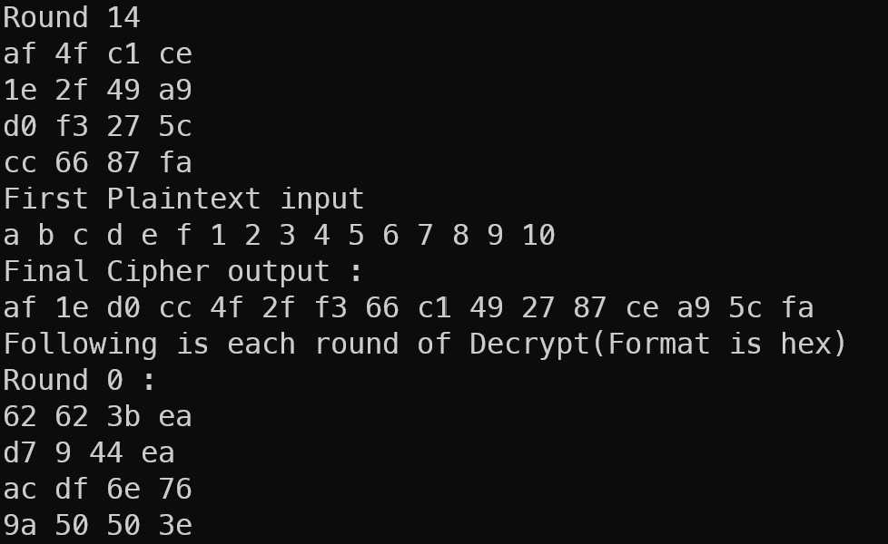
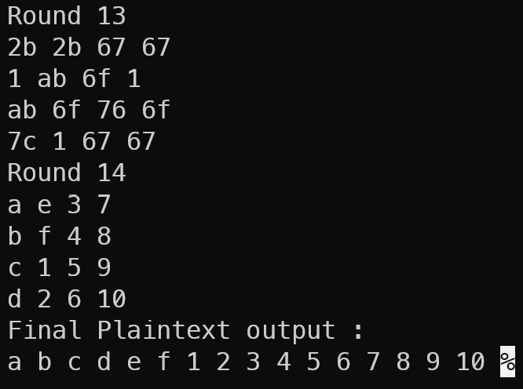
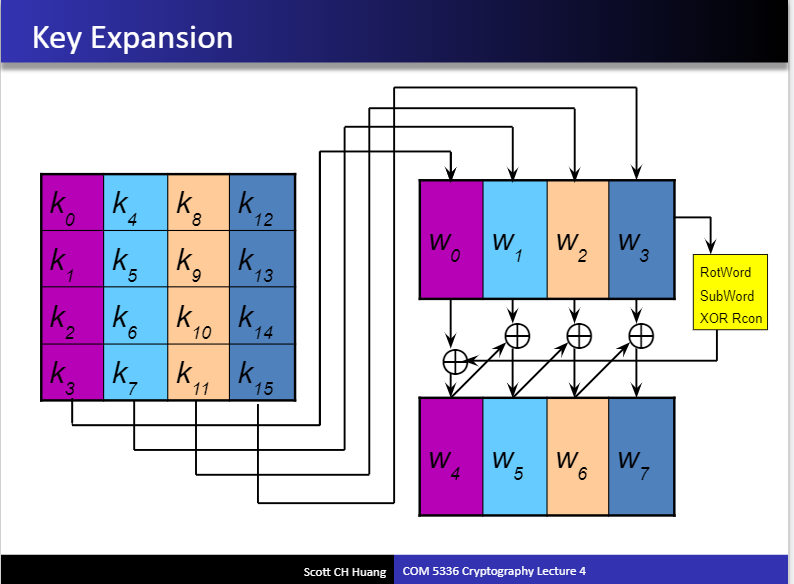

# 網路安全 HW2：AES

## 106021226 蔡皓宇

## **使用說明**

使用 make指令可直接 compile and run
若已經compile過，可使用 make run指令
make clean可清除多餘檔案

首先輸入AES格式，分別為AES-128, AES-192, AES-256，
以下為範例輸入


## **Output Result**
輸出會輸出加密與解密每個round的結果，以4*4矩陣表示每個state

...中間省略

並會在加密結束後輸出加密後的Ciphertext與加密前的Plaintext，再接著輸出解密的每回合state

最後解密完後輸出解密得到的plaintext，與輸入的paintext相同

## **code 講解**

在開始加密前，要先將input的key expand成round key
expand的方法如silde所示

每個column，共有4個unit8_t，共32bit組成一個word
而以初始的4個word以slide的方式生成每回合所需的round key
共有44個words
(AES-128)
```c++
void key_expasion(unit8_t *Key)
{
    unit8_t temp[4];
    unit8_t tmp;
    //first round subkey = main key divide to (Nb_k) block and each block is 32bit.
    //ex AES-128 4 block W0~W3
    for (int i = 0; i < Nb_k; i++)
    {
        roundkey[i * 4] = Key[i * 4];
        roundkey[i * 4 + 1] = Key[i * 4 + 1];
        roundkey[i * 4 + 2] = Key[i * 4 + 2];
        roundkey[i * 4 + 3] = Key[i * 4 + 3]; //i+0~i+4 is w_i(32bit)
    }
    //other subkey
    for (int i = Nb_k; i < (Nb * (Nr + 1)); i++)
    {
        for (int j = 0; j < Nb; j++)
            temp[j] = roundkey[(i - 1) * 4 + j]; //e.g. 計算w4需要先取w3的值做rotword subword xor rocn, w5 = w4 xor w1
        if (i % Nb_k == 0)
        {
            //Rotword
            tmp = temp[0];
            for (int c = 0; c < 3; c++)
                temp[c] = temp[c + 1];
            temp[3] = tmp;

            //subword(S-box substitution) means find inverse and do affine trans
            for (int c = 0; c < 4; c++)
            {
                temp[c] = affine_transformation(GF256_inv(&temp[c], f_mx));
            }

            //XOR (Rcon[i/Nb_k],0,0,0)
            temp[0] = GF256_add(temp[0], Rcon[i / Nb_k], f_mx);
        }
        else if (Nb_k == 8 && i % Nb_k == 4)
        {
            //AES-256
            //i mod 4 =0, i mod 8 !=0, W_n = Subword(W_(n-1)) XOR W_(n-8)
            for (int c = 0; c < 4; c++)
                temp[c] = affine_transformation(GF256_inv(&temp[c], f_mx));
        }
        // W_n = W_n-1 xor W_k, k = current word - Nb_k
        //eg: AES-128, Nb_k=4, W5 = W4 XOR W1
        for (int c = 0; c < 4; c++)
        {
            roundkey[i * 4 + c] = GF256_add(roundkey[(i - Nb_k) * 4 + c], temp[c], f_mx);
        }
    }
}
```
***加密部分***


加密部分分為，除round0, round final都需經過這四個步驟
```c++
    ByteSub();
    ShiftRow('L');//代表left shift
    MixColumn();
    AddRoundKey(round);
```

**ByteSub**

其中ByteSub()即將state的值置換成取反元素後進行affine transformation的值。
而affine transformation如下
```c++
unit8_t affine_transformation(unit8_t b)
{ //s=b+(b<<1)+(b<<2)+(b<<3)+(b<<4)+63_hex where << is circular shift, + is under GF256, b is multi inverse
    unit8_t s = 0x0;
    unit8_t tmp;
    for (int i = 0; i < 4; i++)
    {
        s = GF256_add(s, b, f_mx);
        b = leftshift1(b);
    }
    s = GF256_add(s, b, f_mx);
    s = GF256_add(s, 0x63, f_mx);
    return s;
}
```
而反元素的找法則利用乘法子群為cyclic的性質，GF(256)的乘法子群order為255，因此任一元素的254次方即為該元素的反元素。
```c++
uint8_t GF256_inv(uint8_t *a, uint8_t mx)
{ //since multi subgroup is cyclic with order 255, so input a^254 is a inverse
    unit8_t return_val = *a;

    //improve speed 減少迴圈數量得到254次方
    for (int i = 13; i != 0; i--)
    {
        return_val = GF256_mult(return_val, i & 1 ? return_val : *a, mx);
    }

    /*
    for (int i = 0; i < 253; i++)
    {
        counter++;
        return_val = GF256_mult(return_val, *a, f_mx);
    }
    */

    return return_val;
}
```

而ByteSub_inv() 即為先做affine transformation的反運算再取反元素。

**ShiftRow**

ShifRow()很單純的就是將state的每個row做circular shift
加密做left解密做right

**Mixcolumn**

Mixcolumn()
將state的每個column當成系數構成degree 3的polynomial。
乘以 $3x^3+x^2+x+2$ 並 mod $x^4+1$

經過化簡後得到silde中的矩陣運算
而Mixcolumn_inv()當然可以很簡單的利用反矩陣的性質得到。

**AddRoundkey**

AddRoundkey(round)很單純的就是將先前生成的round key與state做XOR也就是GF256下的加法運算。

***解密部分***

理解了加密後，由於是對稱加密，因此解密也相當容易，只要將加密的運算反過來操作即可。


## **總結**
AES加密為很單純的對稱式加密，只須了解每個加密步驟後很單純的實作出來即可，中間牽涉到一些有限體的概念並不是特別複雜。